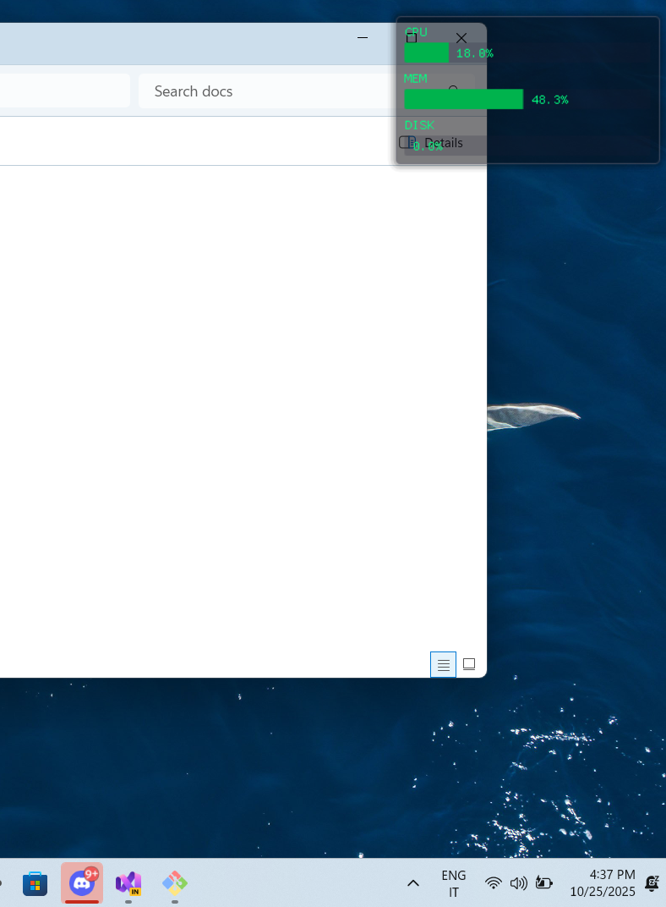

# PerformanceMonitorWidget

A lightweight, always-on-top performance monitoring overlay for Windows. Built with C++ using Direct3D 11 and Dear ImGui.

## Overview

PerformanceMonitorWidget displays real-time CPU, memory, and disk usage statistics in a transparent overlay that stays visible across all applications. The widget appears in the corner of your screen and doesn't interfere with your work—mouse clicks pass right through it.

Perfect for keeping an eye on system performance while gaming, developing, or running intensive applications.

## Features

- **Real-time Monitoring**: Tracks CPU, memory, and disk usage continuously
- **Transparent Overlay**: Semi-transparent window with modern acrylic blur effect
- **Non-intrusive**: Click-through design doesn't block mouse interaction with other windows
- **Always Visible**: Stays on top of all other applications
- **System Tray**: Minimizes to system tray when not needed
- **Low Overhead**: Minimal resource consumption (~10-15 MB RAM, <1% CPU)

## Screenshots


*The overlay displays in the top-right corner showing CPU, memory, and disk metrics*

## Requirements

- Windows 10 or later
- Visual Studio 2022 or later (for building from source)
- Windows SDK 10.0 or higher

## Building from Source

1. Clone the repository:
   ```bash
   git clone https://github.com/lauralex/PerformanceMonitorWidget.git
   cd PerformanceMonitorWidget
   ```

2. Open `PerformanceOverlay.slnx` in Visual Studio 2022

3. Select your build configuration:
   - **Platform**: x64 (recommended) or x86
   - **Configuration**: Release or Debug

4. Build the solution (Ctrl+Shift+B)

5. Find the executable:
   - Release: `./x64/Release/PerformanceOverlay.exe`
   - Debug: `./x64/Debug/PerformanceOverlay.exe`

## Usage

Simply run `PerformanceOverlay.exe`. The overlay will appear in the top-right corner displaying:

- **CPU**: Processor utilization percentage
- **MEM**: Physical memory usage percentage  
- **DISK**: Disk activity percentage

### System Tray

The application adds an icon to your system tray. Right-click the icon to exit the application.

## How It Works

The application uses Windows Management Instrumentation (WMI) to collect performance data and renders it using Direct3D 11 with Dear ImGui. The window uses Desktop Window Manager (DWM) transparency features to create the overlay effect.

## Customization

You can modify the overlay's appearance by editing `Gui::RenderPerformanceWindow()` in `Gui.cpp`:

- Change position, size, or colors
- Add or remove metrics
- Adjust the update frequency

## Technology Stack

- **Language**: C++17
- **Graphics**: Direct3D 11
- **UI**: Dear ImGui
- **Performance Data**: Windows Management Instrumentation (WMI)
- **Build System**: Visual Studio / MSBuild

## Project Structure

```
PerformanceMonitorWidget/
├── PerformanceOverlay/         # Main application code
│   ├── main.cpp                # Entry point
│   ├── D3D11Renderer.cpp/.h    # Graphics rendering
│   ├── Gui.cpp/.h              # UI rendering
│   └── PerformanceMonitor.cpp/.h  # Performance data collection
└── libs/
    └── imgui/                  # Dear ImGui library
```

## Known Limitations

- Windows-only
- Fixed position (not draggable)
- Single monitor support

## License

Licensed under the Apache License 2.0. See [LICENSE](LICENSE) for details.

## Author

Alessandro Bellia

## Acknowledgments

Built with [Dear ImGui](https://github.com/ocornut/imgui) by Omar Cornut
